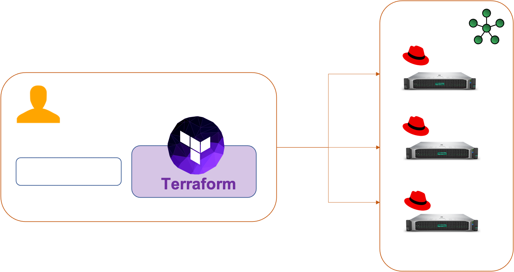

# k8sdeploy-cri-terraform
Installing Kubernetes with CRI-O on bare-metal with Terraform and kubeadm
A few months ago Kubernetes announced the depreciation of Docker in the next version, in a previous post I explained why.
[Kubernetes is deprecating Docker in the upcoming release.](https://techlabnews.com/2021/kubernetes-crio/).


The purpose of this post is to use the work done in the post : [Installing Kubernetes on bare-metal with Terraform and kubeadm](https://techlabnews.com/2021/terraform-k8s/)
to install kubernetes without docker but with CRI-O and you show that it doesn't change anything the execution of Docker images.

## Prerequisites

Before you get started, you’ll need to have these things:
* Terraform > 0.13.x
* kubectl installed on the compute that hosts terraform
* A minimum of two servers installed with Centos or RedHat Enterprise (Release : 7.x - 8.x)
* On each servers :
  * Generate a ras ssh key.
  * Update the authorized_keys file with the public keys

## Infra



## Initial setup

Clone the repository and install the dependencies:


```

$ git clone https://github.com/colussim/k8sdeploy-cri-terraform.git
$ cd k8sdeploy-cri-terraform
$ terraform init


```

## Usage

Create an bare-metal Kubernetes cluster with one master and two nodes:

```
$ terraform apply \
 -var="crio_version=1.21" \
 -var="k8s_version=1.21.0-0.x86_64" \
 -var="master=k8s1" \
 -var='worker=["k8s2","k8s3"]' \
 -var="clustername=epc-k8s1"

```

If you use the ***terraform apply*** command without parameters the default values will be those defined in the ***variables.tf*** file.

This will do the following :
* connects to the master server via SSH and installs CRIO , kubeadm and rpm packages
* runs kubeadm init on the master server and configures kubectl
* installs Weave Net with encrypted overlay
* install cluster add-on (Kubernetes dashboard)
* create a ServiceAccount : admin-user and set authorization
* connects to the workers via SSH and installs CRIO , kubeadm and rpm packages
* starts the worker nodes
* joins the worker nodes in the cluster using the kubeadm token obtained from the master

Scale up by add hostname or ip address in *worker* variable


```
-var='worker=["k8s2","k8s3","xxxxxxx"]'

```

Tear down the whole Terraform plan with :

```
$ terraform destroy -force

```

Resources can be destroyed using the terraform destroy command, which is similar to terraform apply but it behaves as if all of the resources have been removed from the configuration.

## Remote control

Check if your cluster works:


```
$ kubectl --kubeconfig $PWD/admin.conf get nodes \
 -o custom-columns='NAME:metadata.name,STATUS:status.conditions[4].type,\
 VERSION:status.nodeInfo.kubeletVersion,\
 CONTAINER-RUNTIME:status.nodeInfo.containerRuntimeVersion'

 NAME                      STATUS   VERSION   CONTAINER-RUNTIME
 k8s1.hpemscc.hpecic.net   Ready    v1.21.1   cri-o://1.21.0
 k8s2.hpemscc.hpecic.net   Ready    v1.21.1   cri-o://1.21.0
 k8s3.hpemscc.hpecic.net   Ready    v1.21.1   cri-o://1.21.0


```

We can see that we use CRI-O instead of docker.

if we used docker we would have the following result :


```
NAME        STATUS   VERSION   CONTAINER-RUNTIME
bandol      Ready    v1.21.1   docker://20.10.6
cabernet1   Ready    v1.21.1   docker://20.10.6
sauvignon   Ready    v1.21.1   docker://20.10.6

```


To access the dashboard you’ll need to find its cluster IP :

```
$ kubectl --kubeconfig $PWD/admin.conf -n kubernetes-dashboard get svc --selector=k8s-app=kubernetes-dashboard

NNAME                   TYPE        CLUSTER-IP     EXTERNAL-IP   PORT(S)   AGE
kubernetes-dashboard   ClusterIP   10.111.70.45   <none>        443/TCP   2m21s


```

Get token for the connection to the dashboard :

```
$ kubectl -n kubernetes-dashboard get secret $(kubectl -n kubernetes-dashboard \
  get sa/admin-user -o jsonpath="{.secrets[0].name}") \
  -o go-template="{{.data.token | base64decode}}"

  eyJhbGciOiJSUzI1NiIsImtpZCI6Ijd1MlVaQUlJMmdTTERWOENacm9TM0pTQ0FicXoyaDhGbnF5R1
  7aM-uyljuv9ahDPkLJKJ0cnen1YDcsswwdIYL3mnW3b1E07zOR99w2d_PM_4jlFXnFt4TvIQ7YY57L
  2DDo60vlD1w3lI0z_ogT8sj5Kk1srPE3L6TuIOqWfDSaMNe65gK0j5OJiTO7oEBG5JUgXbwGb8zOK
  iPPQNvwrBu6updtqpI1tnU1A4lKzV70GS7pcoqqHMl26D1l0C4-IbZdd1oFJz3XnbTNybWIewh9R3v
  6fUC4lbPfKcpf-qte4qCw51QkDiQ
  $

```

copy and paste the token value in the dashboard connection window (in next step)

Open a SSH tunnel:

```
$ ssh -L 8888:10.111.70.45:443 root@k8s1

```

Now you can access the dashboard on your computer at http://localhost:8888.
Paste the token value :


We can use the OpenEBS installation
with the CSI Driver described in the previous posts ([Using HELM Chart to Deploying OpenEBS to an Kubernetes Cluster using Terraform](../terraform-openebs/index.html) and [OpenEBS CStor CSI Driver](../openebs-csi/index.html)
 ) and deploy our SQL Server instance, it will not have any change.

We will deploy a SQL Server instance, to verify that it works using CRI-O.
We will use the following yaml file: [deploy-mssql-s.yaml](https://github.com/colussim/openebsdeploy-terraform/blob/main/scripts/csi/deploy-mssql-s.yaml)


```
 $ kubectl create -f deploy-mssql-s.yaml -n student1
 secret/csi-sqlsecret-student1 created
 deployment.apps/mssql-deployment created
 service/mssql-service created
 $

```


 Check if your SQL Server instance works:


```
 $ kubectl get pods -n student1

 NAME                                READY   STATUS    RESTARTS   AGE
 mssql-deployment-54f64b78cb-mz8tt   1/1     Running   0          6s
 $

```

It is running cool ....

To access the SQL Server Instance you’ll need to find its port map :


```
$ kubectl get svc -n student1
NAME            TYPE       CLUSTER-IP      EXTERNAL-IP   PORT(S)          AGE
mssql-service   NodePort   10.111.17.236   <none>        1433:32239/TCP   16m


```

In our deployment for the service we used the NodePort directive and port 1433 is mapped externally to port 32239. We can access our instance by specifying the name (or ip address) of one of the cluster nodes and port 32239.

You can connect to the SQL Server instance outside the Kubernetes cluster with command line :


```
$ sqlcmd -U sa -P HPeinvent@ -S k8s1,32239 -q "select @@version"

Microsoft SQL Server 2019 (RTM-CU10) (KB5001090) - 15.0.4123.1 (X64)
        Mar 22 2021 18:10:24
        Copyright (C) 2019 Microsoft Corporation
        Developer Edition (64-bit) on Linux (Red Hat Enterprise Linux 8.3 (Ootpa)) <X64>                                                                                    
(1 rows affected)
$

```

## Conclusion

We just saw that not using docker with kubernetes doesn't change the way we use our docker created containers.
Migrating to another runtime container than Docker (to continue using kubernetes) is completely transparent.

## Resources :


